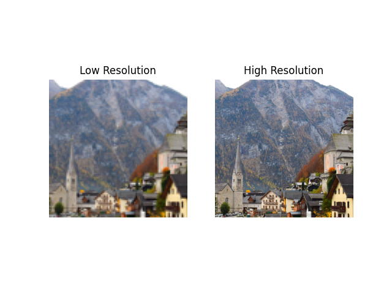

# INFORMATION

This repository contains the script needed to download the datasets (e.g. from HuggingFace) and render them normal PyTorch DataLoaders.

## Necessary imports
```
!pip install -qq datasets
```
This line installs the datasets library, where we will obtain the DIV2K dataset.

## Getting dataset information
This is not crucial throughout model development and training, but for this repository, this is included for clarity. Also note the structure of the DIV2K dataset.
## Overall information
```
from datasets import load_dataset_builder
ds_builder = load_dataset_builder("eugenesiow/Div2k", "bicubic_x2")

print(ds_builder.info.description)
print(ds_builder.info.features)
```

> DIV2K dataset: DIVerse 2K resolution high quality images as used for the challenges @ NTIRE (CVPR 2017 and 
CVPR 2018) and @ PIRM (ECCV 2018)
> {'lr': Value(dtype='string', id=None), 'hr': Value(dtype='string', id=None)}

In essence, the dataset is really a Python dictionary of links (which is why dtype='string') to the high-resolution and corresponding low-resolution images.

### Configuration information
```
from datasets import get_dataset_config_names

configs = get_dataset_config_names("eugenesiow/Div2k")
print(configs)
```

> ['bicubic_x2', 'bicubic_x3', 'bicubic_x4', 'bicubic_x8', 'unknown_x2', 'unknown_x3', 'unknown_x4', 'realistic_mild_x4', 'realistic_difficult_x4', 'realistic_wild_x4']

Corresponding to a high-resolution image, there are variants of low-resolution ones.
* *'bicubic_x2'* to '*bicubic_x8'* refers to images that has been downscaled to a certain ratio (1/2, 1/3, 1/4, 1/8), using the bicubic interpolation (see the demonstration for downscaling in the 'miscellaneous' folder).
* *'unknown_x2'* to *'unknown_x4'* refers to images that has also been downscaled to ratio, but with a hidden (unknown) method of downscaling.
* *'realistic_mild_x4'*, *'realistic_difficult_x4'*, and *'realistic_wild_x4'* refers to 4-time downscaled images that also suffer from motion blur, Poisson noise and pixel shifting. The 'mild' subset suffers less, the 'difficult' more, and the 'wild' shows varying levels of degradation from image to image.

## Split information
```
from datasets import get_dataset_split_names

get_dataset_split_names("eugenesiow/Div2k", "bicubic_x2") # Chosen configuration: bicubic_x2
```

> ['train', 'validation']

There are 800 images for training, and 100 for validation. The private test data are kept hidden.

---
# INSTRUCTION

**1. Clone the repository**
```
!git clone https://github.com/vincent-doan/it3220e-dl-superresolution-project.git
```

**2. Install the necessary packages**
```
!pip install -q -r it3220e-dl-superresolution-project/requirements.txt
```

**3. Use the DIV2KDataLoader class**</br>
Here is a sample piece of code.
```
from data.dataloaders import DIV2KDataLoader
import matplotlib.pyplot as plt

train_dataloader = DIV2KDataLoader(downscale_type="bicubic", scale=8, transforms=None, seed=1989, batch_size=1, shuffle=True, num_crops=2)
print("Length of train_dataloader: {}".format(len(train_dataloader)))

lrs, hrs = next(iter(train_dataloader))

lr = lrs[0].permute((1, 2, 0))
hr = hrs[0].permute((1, 2, 0))

fig, axs = plt.subplots(1, 2)

axs[0].imshow(lr)
axs[0].set_title('Low Resolution')
axs[1].imshow(hr)
axs[1].set_title('High Resolution')

for ax in axs.flat:
    ax.axis('off')

plt.show()
```

> Length of train_dataloader: 1600



Two transformations are automatically done - a 768x768 crop (making sure the content of both the low-resolution and high-resolution images still matches) and a ToTensor

Note that the length of the dataloader is now 1600, while the original training set only contains 800. This is because by specifying num_crops=2, we are essentially creating two datasets by cropping each image randomly two times. The two datasets are concatenated to make a final training set. For an unaugmented version, simply specify num_crops=1.

Parameters in consideration when creating a dataloader include
| Parameter        | Type                  | Values                                                                                                                   | Default  |
|------------------|-----------------------|--------------------------------------------------------------------------------------------------------------------------|----------|
| split            | str                   | one of `[‘train’, ‘validation’]` - split of the data to use                                                              | 'train'  |
| downscale_type   | str                   | one of `['bicubic', 'unknown', 'realistic_mild', 'realistic_difficult', 'realistic_wild']` - type of downscaling method  | 'bicubic'|
| scale            | int                   | for 'bicubic' downscale_type, one of `[2, 3, 4, 8]` - for 'unknown', one of `[2, 3, 4]` - for others, only `4` - scaling factor | 4 |
| transforms       | transforms.Compose    | list of transforms for data augmentation                                                                                 | None     |
| seed             | int                   | a random seed for transformations                                                                                        | 1989     |
| batch_size       | int                   | number of images per batch                                                                                               | 1        |
| shuffle          | bool                  | whether to shuffle images in the dataloader                                                                              | True     |
| num_crops        | int                   | number of random crops - the size of the dataset will be multiplied accordingly                                          | 1        |

After being created, the dataloader can be used as normal.
