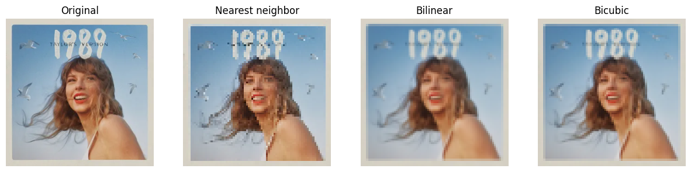

# Image Downscaling with PyTorch

This repository contains a Python script that demonstrates how to downscale an image using different interpolation methods in PyTorch. The script uses the following interpolation methods:

- Nearest neighbor
- Bilinear
- Bicubic

